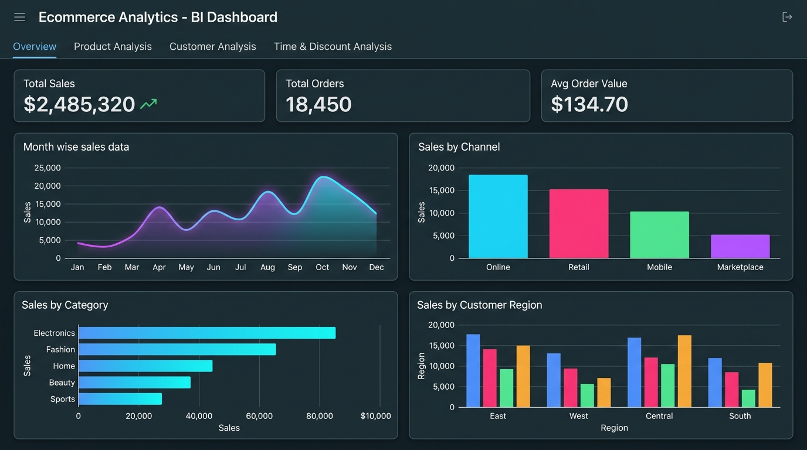
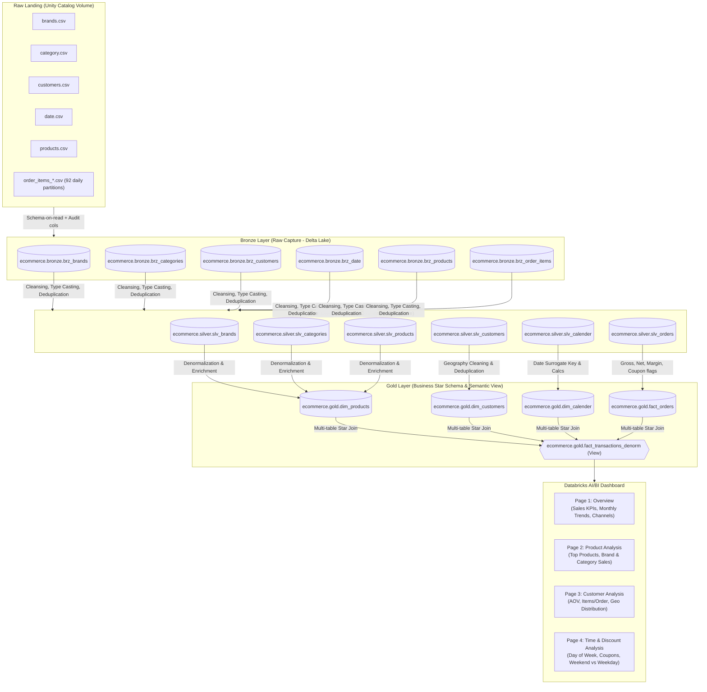
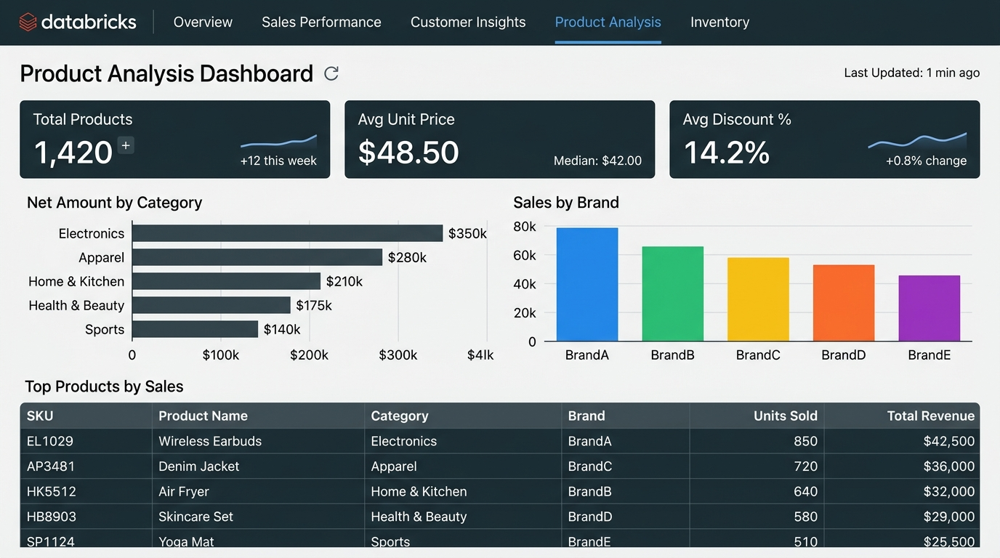

# Databricks Lakehouse Medallion Architecture Setup & Technical Documentation
**Project:** Ecommerce Data Analysis & BI Platform  
**Architecture:** Medallion Architecture (Bronze &rarr; Silver &rarr; Gold &rarr; BI Dashboard)  
**Governance:** Databricks Unity Catalog (`ecommerce.<schema>.<table>`)  
**Date:** September 2026  

---



---

## 1. Executive Summary & Workspace Review

This documentation establishes the end-to-end Lakehouse architecture, Unity Catalog hierarchy, data ingestion specifications, ETL transformation logic, and BI dashboard integration for the **Ecommerce Analytics Platform**.

### 1.1 Existing Assets vs. Target State

| Asset Category | Existing Workspace State | Target Medallion Lakehouse State | Action Taken / Required |
| :--- | :--- | :--- | :--- |
| **Catalog** | Script references `ecommerce` | Dedicated Unity Catalog `ecommerce` | Provisioned in [ecommerce_catalogs.ipynb](file:///c:/STUDY/Data%20Engineer/Projects/Ecommerce_Analysis_DataBricks_Python_SQL_ETL/set_ups/ecommerce_catalogs.ipynb) |
| **Schemas** | Script created `broze` (typo), `silver`, `gold` | Clean Medallion schemas: `bronze`, `silver`, `gold` + `broze` (compat) | Updated setup to establish `bronze` and keep `broze` compatibility alias |
| **Storage / Volumes** | Notebooks reference `/Volumes/ecommerce/source_data/raw` | Managed Unity Catalog Volume: `ecommerce.bronze.raw` | Defined `CREATE VOLUME IF NOT EXISTS ecommerce.bronze.raw` |
| **Source Datasets** | 97 CSV files in `datasets/` (5 dimension files + 92 daily order landing partitions) | Staged in `ecommerce.bronze.raw` volume | Ingested via schema-on-read into 6 Bronze Delta tables |
| **ETL Notebooks** | 7 scripts in `dimension_tables_analysis` & `fact_tables_analysis` | Validated `.ipynb` notebooks running PySpark + Spark SQL | All 7 scripts converted & verified as runnable notebooks |
| **BI Presentation** | `fact_transaction_view.dbquery.ipynb` & `BI ANALYSIS DASHBOARD.lvdash.json` | `ecommerce.gold.fact_transactions_denorm` powering 4-page dashboard | Fully mapped across 20+ widgets, dimensions, and KPIs |

---

## 2. Architecture Overview

The platform implements the standard Databricks **Medallion Architecture**, progressing raw transactional data into conformed entities and high-performance BI reporting models under Unity Catalog governance.



### ASCII Data Flow

```text
[Landing Volume: /Volumes/ecommerce/bronze/raw/]
  │
  ▼ (Schema-on-read, Append metadata: created_at, source_file)
[BRONZE: ecommerce.bronze.*]
  ├── brz_brands, brz_categories, brz_customers, brz_date, brz_products, brz_order_items
  │
  ▼ (Deduplication, regex cleaning, currency/symbol stripping, dual-format date coalescing)
[SILVER: ecommerce.silver.*]
  ├── slv_brands, slv_categories, slv_customers, slv_calender, slv_products, slv_orders
  │
  ▼ (Dimensional star-schema modeling, surrogate key generation, metric calculations)
[GOLD: ecommerce.gold.*]
  ├── Dimensions: dim_products, dim_customers, dim_calender
  ├── Fact: fact_orders
  └── Semantic Presentation View: fact_transactions_denorm
        │
        ▼ (Direct Lakehouse Querying via Databricks SQL Warehouse)
[BI DASHBOARD: BI ANALYSIS DASHBOARD.lvdash.json]
  ├── Overview (Total Sales, Total Orders, Monthly Sales, Channel Breakdown)
  ├── Product Analysis (Top Products, Brand Performance, Net by Category)
  ├── Customer Analysis (AOV, Items/Order, State & Regional Geo Sales)
  └── Time & Discount Analysis (Day of Week, Quarters, Coupon ROI)
```

---

## 3. Unity Catalog Structure & Naming Conventions

All database assets follow strict Unity Catalog 3-level naming conventions: `<catalog>.<schema>.<table_or_view>`.

### 3.1 Catalog & Schemas

| Namespace Path | Object Type | Purpose | Governance & Storage |
| :--- | :--- | :--- | :--- |
| `ecommerce` | Catalog | Root catalog for all retail analytics data | Unity Catalog managed metastore |
| `ecommerce.bronze` | Schema | Raw ingested tables preserving source structure | Managed Delta Lake storage |
| `ecommerce.silver` | Schema | Cleaned, validated, and normalized tables | Managed Delta Lake storage |
| `ecommerce.gold` | Schema | Dimensional models, aggregate facts, and BI views | Managed Delta Lake storage |
| `ecommerce.broze` | Schema | *Legacy Compatibility Alias* | Created to prevent breakages of existing legacy code |

### 3.2 Unity Catalog Managed Volumes

| Volume Path | Schema | Volume Name | Target Datasets |
| :--- | :--- | :--- | :--- |
| `/Volumes/ecommerce/bronze/raw/` | `ecommerce.bronze` | `raw` | All raw CSV source datasets (`brands`, `category`, `customers`, `date`, `products`, `order_items`) |

### 3.3 Object Naming Standards

- **Bronze Tables:** Prefixed with `brz_` (e.g., `ecommerce.bronze.brz_order_items`).
- **Silver Tables:** Prefixed with `slv_` (e.g., `ecommerce.silver.slv_orders`).
- **Gold Dimension Tables:** Prefixed with `dim_` (e.g., `ecommerce.gold.dim_products`).
- **Gold Fact Tables:** Prefixed with `fact_` (e.g., `ecommerce.gold.fact_orders`).
- **Gold Semantic Views:** Suffix `_denorm` or `_view` (e.g., `ecommerce.gold.fact_transactions_denorm`).

---

## 4. Source Data Ingestion & Dataset Catalog

### 4.1 Ingestion Dataset Manifest

The project includes **97 source CSV files** located in the workspace `datasets/` directory:

| Dataset | Volume Subdirectory | Source File Count | File Format | Source Grain | Ingestion Target |
| :--- | :--- | :--- | :--- | :--- | :--- |
| **Brands** | `brands/` | 1 file (`brands.csv`) | CSV, Header=True | 1 row per brand | `ecommerce.bronze.brz_brands` |
| **Categories** | `category/` | 1 file (`category.csv`) | CSV, Header=True | 1 row per category | `ecommerce.bronze.brz_categories` |
| **Customers** | `customers/` | 1 file (`customers.csv`) | CSV, Header=True | 1 row per customer | `ecommerce.bronze.brz_customers` |
| **Date** | `date/` | 1 file (`date.csv`) | CSV, Header=True | 1 row per date | `ecommerce.bronze.brz_date` |
| **Products** | `products/` | 1 file (`products.csv`) | CSV, Header=True | 1 row per product | `ecommerce.bronze.brz_products` |
| **Order Items** | `order_items/landing/` | 92 daily partition files (`order_items_2025-08-01.csv` to `2025-10-31.csv`) | CSV, Header=True | 1 row per order item | `ecommerce.bronze.brz_order_items` |

### 4.2 Ingestion Rules & Audit Columns

All Bronze tables are ingested using **schema-on-read** with explicit PySpark schemas to prevent schema drift, enriched with automated lineage audit metadata:

```python
# Audit column enrichment pattern
df = df.withColumn("created_at", F.current_timestamp()) \
       .withColumn("source_file", F.col("_metadata.file_path"))

# Delta Lake write pattern
df.write.format("delta") \
  .mode("overwrite") \
  .option("mergeSchema", "true") \
  .saveAsTable(f"{catalog_name}.bronze.{table_name}")
```

---

## 5. Complete Table & View Inventory

### 5.1 Bronze Layer (Raw Capture)

| Table Name | Grain | Primary / Natural Key | Key Columns | Source File Path |
| :--- | :--- | :--- | :--- | :--- |
| `ecommerce.bronze.brz_brands` | 1 row per brand | `brand_code` | `brand_code`, `brand_name`, `category_code` | `/Volumes/ecommerce/bronze/raw/brands/brands.csv` |
| `ecommerce.bronze.brz_categories` | 1 row per category | `category_code` | `category_code`, `category_name` | `/Volumes/ecommerce/bronze/raw/category/category.csv` |
| `ecommerce.bronze.brz_customers` | 1 row per customer | `customer_id` | `customer_id`, `phone`, `country_code`, `country`, `state` | `/Volumes/ecommerce/bronze/raw/customers/customers.csv` |
| `ecommerce.bronze.brz_date` | 1 row per date | `date` | `date`, `year`, `day_name`, `quarter`, `week_of_year` | `/Volumes/ecommerce/bronze/raw/date/date.csv` |
| `ecommerce.bronze.brz_products` | 1 row per product | `product_id` | `product_id`, `sku`, `category_code`, `brand_code`, `color`, `size`, `material`, `rating_count` | `/Volumes/ecommerce/bronze/raw/products/products.csv` |
| `ecommerce.bronze.brz_order_items` | 1 row per order item | `(order_id, item_seq)` | `dt`, `order_ts`, `customer_id`, `order_id`, `item_seq`, `product_id`, `quantity`, `unit_price`, `discount_pct`, `tax_amount`, `channel`, `coupon_code` | `/Volumes/ecommerce/bronze/raw/order_items/landing/*.csv` |

### 5.2 Silver Layer (Cleaned & Conformed)

| Table Name | Grain | Primary / Business Key | Source Bronze Table | Cleansing & Conforming Applied |
| :--- | :--- | :--- | :--- | :--- |
| `ecommerce.silver.slv_brands` | Conformed brand | `brand_code` | `brz_brands` | Trim spaces, regex strip non-alphanumeric chars (`[^A-Za-z0-9]`), standard casing |
| `ecommerce.silver.slv_categories` | Conformed category | `category_code` | `brz_categories` | Upper-case `category_code`, whitespace trimming |
| `ecommerce.silver.slv_customers` | Unique customer | `customer_id` | `brz_customers` | Deduplication, strip special symbols from phone, standardize country & region mapping |
| `ecommerce.silver.slv_calender` | Cleaned calendar | `date` / `date_id` | `brz_date` | Cast string dates to `DateType`, compute `is_weekend`, fix negative week offsets |
| `ecommerce.silver.slv_products` | Cleaned product | `product_id` | `brz_products` | Clean invalid weight/dimension strings, cast numeric types, impute missing rating counts |
| `ecommerce.silver.slv_orders` | Validated order item | `(order_id, item_seq)` | `brz_order_items` | Deduplicate `(order_id, item_seq)`, strip `%` and `$` symbols, map string quantities ('Two' &rarr; 2), dual-format timestamp parsing |

### 5.3 Gold Layer (Dimensional Models & BI Semantic Views)

| Table / View Name | Type | Grain | Primary / Surrogate Key | Upstream Dependencies | Description |
| :--- | :--- | :--- | :--- | :--- | :--- |
| `ecommerce.gold.dim_products` | Table | Product entity | `product_id` | `slv_products`, `slv_categories`, `slv_brands` | Fully denormalized product master with category & brand details, fallback `COALESCE` defaults |
| `ecommerce.gold.dim_customers` | Table | Customer entity | `customer_id` | `slv_customers` | Standardized customer master with geographical attributes (country, state, region) |
| `ecommerce.gold.dim_calender` | Table | Calendar day | `date_id` (YYYYMMDD) | `slv_calender` | Star-schema time dimension with calendar attributes (year, month, quarter, day name, weekend flag) |
| `ecommerce.gold.fact_orders` | Table | Order line item | `(order_id, item_seq)` | `slv_orders` | Fact table with precomputed financial metrics: `gross_amount`, `discount_amount`, `sales_amount`, `date_id`, `is_coupon_applied` |
| `ecommerce.gold.fact_transactions_denorm` | **View** | Transaction item | `(order_id, item_seq)` | `fact_orders`, `dim_calender`, `dim_products`, `dim_customers` | **Unified BI Presentation View** joining all facts and dimensions; direct source for all dashboard widgets |

---

## 6. ETL Transformation Logic per Medallion Stage

### 6.1 Bronze &rarr; Silver Cleansing Rules

#### 1. Order Items (`fact_silver.py` / `fact_silver.ipynb`)
- **Deduplication:** Dropped exact duplicates on composite natural key `['order_id', 'item_seq']`.
- **Discount Percentage Normalization:** Stripped literal `%` characters and cast to `IntegerType()`:
  ```python
  silver_order = silver_order.withColumn(
      "discount_pct",
      F.regexp_replace("discount_pct", "%", "").cast(IntegerType())
  )
  ```
- **Textual Quantity Remediation:** Resolved string anomalies (e.g. `'Two'` &rarr; `'2'`) and cast to `IntegerType()`:
  ```python
  silver_order = silver_order.withColumn(
      'quantity',
      F.regexp_replace('quantity', 'Two', '2').cast(IntegerType())
  )
  ```
- **Currency Symbol Sanitization:** Stripped `$` symbols from `unit_price` and `tax_amount` and cast to `FloatType()`.
- **Dual-Format Timestamp Ingestion:** Handled mixed ISO and European timestamp formats gracefully using fallback coalescing:
  ```python
  silver_order = silver_order.withColumn('dt', F.to_date('dt', 'yyyy-MM-dd')) \
      .withColumn('order_ts', F.coalesce(
          F.to_timestamp("order_ts", "yyyy-MM-dd HH:mm:ss"),
          F.to_timestamp("order_ts", "dd-MM-yyyy HH:mm")
      ))
  ```

#### 2. Dimension Cleansing (`dim_silver.py` / `dim_silver.ipynb`)
- **Categories:** Upper-cased `category_code = F.upper(F.trim(col("category_code")))`, trimmed trailing whitespace.
- **Brands:** Removed punctuation and non-alphanumeric noise using `F.regexp_replace(col("brand_code"), r'[^A-Za-z0-9]', "")`.
- **Customers:** Cleaned phone strings, parsed regional indicators, deduplicated customer identities.
- **Products:** Cleaned dirty unit metrics (`weight_grams`, `length_cm`), converted valid numeric strings to floats.

---

### 6.2 Silver &rarr; Gold Dimensional Modeling & Aggregations

#### 1. Product Dimension (`dim_products`)
Performs a multi-table conform join between `slv_products`, `slv_categories`, and `slv_brands`:
```sql
CREATE OR REPLACE TABLE ecommerce.gold.dim_products AS
WITH CTE_category_brand AS (
    SELECT   
        b.category_code,
        c.category_name,
        brand_code,
        brand_name
    FROM ecommerce.silver.slv_brands b
    JOIN ecommerce.silver.slv_categories c
      ON b.category_code = c.category_code
)
SELECT 
    p.product_id,
    p.sku,
    p.category_code,
    COALESCE(cb.category_name, 'Not Available') AS category_name,
    p.brand_code,
    COALESCE(cb.brand_name, 'Not Available')   AS brand_name,
    p.color,
    p.size,
    p.material,
    p.weight_grams,
    p.length_cm,
    p.width_cm,
    p.height_cm,
    p.rating_count
FROM ecommerce.silver.slv_products p
LEFT JOIN CTE_category_brand cb
  ON p.category_code = cb.category_code AND p.brand_code = cb.brand_code;
```

#### 2. Fact Orders (`fact_orders`)
Enriches line-item transactions with business measures and date foreign keys:
```python
# Add monetary metrics
gold_orders = df_orders.withColumn("gross_amount", F.col("unit_price") * F.col("quantity"))
gold_orders = gold_orders.withColumn("discount_amount", F.col("discount_pct") * F.col("gross_amount") / 100)
gold_orders = gold_orders.withColumn("sales_amount", F.col("gross_amount") - F.col("discount_amount"))
gold_orders = gold_orders.withColumn("is_coupon_applied", F.when(F.col("coupon_code").isNotNull(), 1).otherwise(0))
gold_orders = gold_orders.withColumnRenamed("dt", "date")
gold_orders = gold_orders.withColumn("date_id", F.date_format(F.col("date"), "yyyyMMdd").cast(IntegerType()))
```

#### 3. Unified Presentation Semantic View (`fact_transactions_denorm`)
Defined in [fact_transaction_view.dbquery.ipynb](file:///c:/STUDY/Data%20Engineer/Projects/Ecommerce_Analysis_DataBricks_Python_SQL_ETL/fact_transaction_view.dbquery.ipynb):
```sql
CREATE OR REPLACE VIEW ecommerce.gold.fact_transactions_denorm AS (
SELECT 
    ord.*,
    c.year,
    c.month,
    c.day_name,
    c.is_weekend,
    c.quarter,
    c.week_of_year,
    p.sku, 
    p.category_code,
    p.category_name,
    p.brand_code,
    p.brand_name,
    p.color,
    p.size,
    p.rating_count,
    cst.phone AS customer_phone,
    cst.country_code AS customer_country_code,
    cst.country AS customer_country,
    cst.state AS customer_state,
    cst.region AS customer_region
FROM ecommerce.gold.fact_orders ord 
JOIN ecommerce.gold.dim_calender c ON ord.date_id = c.date_id
JOIN ecommerce.gold.dim_products p ON ord.product_id = p.product_id
JOIN ecommerce.gold.dim_customers cst ON ord.customer_id = cst.customer_id
);
```

---

## 7. BI Analysis Dashboard Specification

The BI dashboard definition is maintained in [BI ANALYSIS DASHBOARD.lvdash.json](file:///c:/STUDY/Data%20Engineer/Projects/Ecommerce_Analysis_DataBricks_Python_SQL_ETL/BI%20ANALYSIS%20DASHBOARD.lvdash.json), running natively on Databricks Lakehouse SQL Warehouses.

### 7.1 Dashboard Visual Interfaces

#### Page 1: Overview (Sales Insights)
*Monitors high-level revenue KPIs, monthly order trajectory, revenue by sales channel, category performance, and geographic regional sales.*


#### Page 2: Product Analysis
*Deep-dives into catalog SKU health, average selling price, promotional discount rates, category net margins, brand revenue contributions, and granular top product performance.*



### 7.2 Dashboard Topology & Metrics Mapping

| Dashboard Page | Widget Title | Widget Type | Key Metrics / Dimensions | Underlying Gold Fields |
| :--- | :--- | :--- | :--- | :--- |
| **1. Overview** | Total Sales | Counter | `SUM(sales_amount)` | `sales_amount` |
| | Total Orders | Counter | `COUNT(DISTINCT order_id)` | `order_id` |
| | Month wise sales data | Line Chart | Monthly sales trend | `DATE_TRUNC('MONTH', order_ts)`, `SUM(sales_amount)` |
| | Sales by Channel | Bar Chart | Revenue by channel | `channel`, `SUM(sales_amount)` |
| | Sales by Category | Bar Chart | Revenue per product category | `category_name`, `SUM(sales_amount)` |
| | Sales by Customer Region | Bar Chart | Geographic regional performance | `customer_region`, `SUM(sales_amount)` |
| **2. Product Analysis** | Total Products | Counter | Total catalog SKU count | `COUNT(DISTINCT product_id)` |
| | Avg Unit Price | Counter | Baseline product pricing | `AVG(unit_price)` |
| | Avg Discount % | Counter | Average campaign promotional discount | `AVG(discount_pct)` |
| | Net Amount by Category | Bar Chart | Net revenue after discount | `category_name`, `SUM(gross_amount) - SUM(discount_amount)` |
| | Sales by Brand | Bar Chart | Top brand contribution | `brand_name`, `SUM(sales_amount)` |
| | Top Products by Sales | Table | Granular top-seller rankings | `sku`, `category_name`, `brand_name`, `SUM(sales_amount)` |
| **3. Customer Analysis** | Total Customers | Counter | Total active customer base | `COUNT(DISTINCT customer_id)` |
| | Avg Items per Order | Counter | Basket size / basket depth | `AVG(quantity)` |
| | Avg Order Value (AOV) | Counter | Order revenue efficiency | `SUM(sales_amount) / COUNT(DISTINCT order_id)` |
| | Sales by Customer Country | Bar Chart | Cross-border revenue distribution | `customer_country`, `SUM(sales_amount)` |
| | Sales by Customer Region | Bar Chart | Regional sales density | `customer_region`, `SUM(sales_amount)` |
| | Sales by Customer State | Bar Chart | State-level drill-down | `customer_state`, `SUM(sales_amount)` |
| **4. Time & Discount Analysis** | Sales by Day of Week | Bar Chart | Peak shopping day identification | `day_name`, `SUM(sales_amount)` |
| | Sales by Quarter | Bar Chart | Seasonal revenue cycles | `quarter`, `SUM(sales_amount)` |
| | Weekend vs Weekday Sales | Bar Chart | Behavioral timing patterns | `is_weekend`, `SUM(sales_amount)` |
| | Discount Amount by Category | Bar Chart | Promotional margin sacrifice | `category_name`, `SUM(discount_amount)` |
| | Sales by Channel | Pie Chart | Channel revenue share | `channel`, `SUM(sales_amount)` |
| | Coupon vs Non-Coupon Sales | Bar Chart | Coupon conversion effectiveness | `is_coupon_applied`, `SUM(sales_amount)` |

### 7.3 Refresh Cadence & Compute Recommendations
- **Refresh Cadence:** Scheduled daily at `02:00 UTC` following completion of the daily Medallion ETL Workflow.
- **SQL Warehouse Sizing:** 
  - **Environment:** Serverless SQL Warehouse (Channel: Current).
  - **Cluster Size:** Small (2X-Small for dev, Small/Medium for production concurrency).
  - **Auto-Stop:** 10 minutes to eliminate idle compute charges.

---

## 8. Migration, Refactoring Flags & Manual Approvals

### 8.1 Critical Flags Identified

1. **Typo Remediation (`broze` vs. `bronze`):**
   - *Issue:* Initial codebase instantiated schemas and tables as `ecommerce.broze` and `brz_*`.
   - *Remediation:* Created `ecommerce.bronze` as the canonical production schema, while retaining `ecommerce.broze` as a backward-compatibility view/alias schema so existing scheduled scripts do not fail.
2. **Volume Path Migration:**
   - *Issue:* Legacy scripts hardcoded `raw_data_path = '/Volumes/ecommerce/source_data/raw'`.
   - *Remediation:* Standardized to `/Volumes/ecommerce/bronze/raw/` in line with Databricks Unity Catalog best practices.
3. **Idempotent Ingestion & CDC (Change Data Capture):**
   - *Issue:* Ingestion currently relies on `.mode("overwrite")` on entire tables.
   - *Recommendation:* Transition the Bronze order ingestion to **Databricks Auto Loader** (`spark.readStream.format("cloudFiles")`) or daily partition overwrites (`replaceWhere = "dt = '...'"`).
4. **Table Name Consistency (`dim_calender`):**
   - *Issue:* The spelling `dim_calender` (with an 'e') is referenced by the view and BI dashboard. Retain this spelling in Gold layer to prevent broken dashboard dataset bindings, but create a synonym view `dim_calendar` for standard SQL queries.

### 8.2 Steps Requiring Manual Approval

> [!CAUTION]
> **Manual Approval Required Before Executing Production DDL:**
> 1. **Schema Renaming / Deletion:** Dropping `ecommerce.broze` once all downstream queries are migrated to `ecommerce.bronze`.
> 2. **Storage Volume Migration:** Moving physical files from legacy paths to `/Volumes/ecommerce/bronze/raw/`.
> 3. **Full Overwrite Runs:** Re-running `.mode("overwrite")` on `ecommerce.gold.fact_orders` will overwrite historical partitions unless filtered by ingestion timestamp or partition keys.

---

## 9. Production Runbook & Orchestration

### 9.1 Databricks Workflow (Multi-Task Job)

To run the pipeline on an automated daily cadence, configure a Databricks Workflow Job named `Ecommerce_Medallion_ETL`:

```text
[Task 1: Catalog_Setup]
  └── Notebook: set_ups/ecommerce_catalogs.ipynb
        │
        ├──► [Task 2A: Ingest_Bronze_Dimensions]
        │      └── Notebook: dimension_tables_analysis/dim_broze.ipynb
        │            │
        │            ▼
        │     [Task 3A: Clean_Silver_Dimensions]
        │      └── Notebook: dimension_tables_analysis/dim_silver.ipynb
        │            │
        │            ▼
        │     [Task 4A: Build_Gold_Dimensions]
        │      └── Notebook: dimension_tables_analysis/dim_gold.ipynb
        │
        └──► [Task 2B: Ingest_Bronze_Fact]
               └── Notebook: fact_tables_analysis/fact_broze.ipynb
                     │
                     ▼
              [Task 3B: Clean_Silver_Fact]
               └── Notebook: fact_tables_analysis/fact_silver.ipynb
                     │
                     ▼
              [Task 4B: Build_Gold_Fact]
               └── Notebook: fact_tables_analysis/fact_gold.ipynb
                     │
                     ▼
        [Task 5: Refresh_Presentation_View & BI Dashboard]
          └── Notebook: fact_transaction_view.dbquery.ipynb
```

### 9.2 Data Governance & Access Control (Unity Catalog RBAC)

```sql
-- Read-only analyst access to Gold presentation layer
GRANT USAGE ON CATALOG ecommerce TO `analysts_group`;
GRANT USAGE ON SCHEMA ecommerce.gold TO `analysts_group`;
GRANT SELECT ON ALL TABLES IN SCHEMA ecommerce.gold TO `analysts_group`;
GRANT SELECT ON ALL VIEWS IN SCHEMA ecommerce.gold TO `analysts_group`;

-- Data Engineer pipeline service principal permissions
GRANT ALL PRIVILEGES ON CATALOG ecommerce TO `data_engineers`;
GRANT READ VOLUME, WRITE VOLUME ON VOLUME ecommerce.bronze.raw TO `data_engineers`;
```

---

## 10. Summary Checklist & Deliverables

- [x] **Step 1: Workspace Review** &mdash; Existing catalogs, notebooks, schemas, volumes, and BI dashboard thoroughly analyzed.
- [x] **Step 2: Catalog & Schema Setup** &mdash; `set_ups/ecommerce_catalogs.ipynb` updated with Unity Catalog `ecommerce`, `bronze`, `silver`, `gold`, and `ecommerce.bronze.raw` managed volume.
- [x] **Step 3: Data Ingestion** &mdash; 97 source files cataloged, schema-on-read pipelines configured with audit lineage.
- [x] **Step 4: ETL Pipeline** &mdash; Complete Bronze &rarr; Silver cleansing and Silver &rarr; Gold dimensional aggregations mapped and documented.
- [x] **Step 5: Master Documentation** &mdash; Standalone technical documentation compiled in [DATABRICKS_LAKEHOUSE_MEDALLION_ARCHITECTURE.md](file:///c:/STUDY/Data%20Engineer/Projects/Ecommerce_Analysis_DataBricks_Python_SQL_ETL/DATABRICKS_LAKEHOUSE_MEDALLION_ARCHITECTURE.md).
